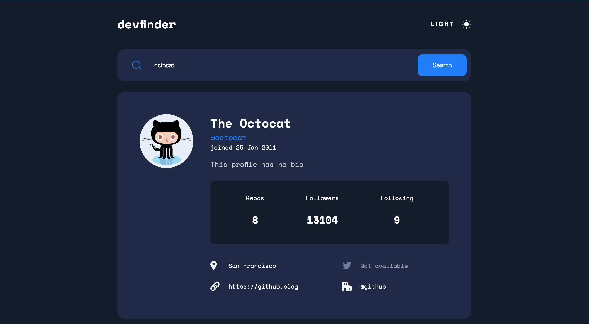

# Devfinder

This is a solution to the [GitHub user search app challenge on Frontend Mentor](https://www.frontendmentor.io/challenges/github-user-search-app-Q09YOgaH6). Frontend Mentor challenges help you improve your coding skills by building realistic projects.

## Table of contents

- [Overview](#overview)
  - [The challenge](#the-challenge)
  - [Screenshot](#screenshot)
  - [Links](#links)
- [My process](#my-process)
  - [Built with](#built-with)
  - [What I learned](#what-i-learned)
  - [Useful resources](#useful-resources)
- [Author](#author)

## Overview

### The challenge

Users should be able to:

- View the optimal layout for the app depending on their device's screen size
- See hover states for all interactive elements on the page
- Search for GitHub users by their username
- See relevant user information based on their search
- Switch between light and dark themes
- **Bonus**: Have the correct color scheme chosen for them based on their computer preferences. _Hint_: Research `prefers-color-scheme` in CSS.

### Screenshot



### Links

- Solution URL: [Challange Submission](https://your-solution-url.com)
- Live Site URL: [Devfinder](https://devfinder-v1.web.app)

## My process

### Built with

- Semantic HTML5 markup
- CSS custom properties
- Flexbox
- Mobile-first workflow
- [React](https://reactjs.org/) - JS library

### What I learned

Defining a global color scheme for an app can be achieved using a combination of the css color-scheme property on the root element and the (prefers-color-scheme) media query. This approach enables to browser to apply the appropriate styling based on the user's system color preference. By default, the initial value selected for the color-scheme is light if the user has not set any specific preference.

```css
:root {
  /* defining global color scheme */
  color-scheme: light dark;
}

/* defining the default styles for the default color scheme */
body {
  --text-color: rgba(75, 106, 155, 1);
}

/* defining the styles for the alternative color scheme */
@media (prefers-color-scheme: dark) {
  body {
    --text-color: rgba(255, 255, 255, 1);
  }
}
```

To enable toggling color modes within the app without affecting system-wide changes, you can define an additional class list, with the same property-value pairs specified in the alternative color-scheme as follows:

```css
body.dark-theme {
  --text-color: rgba(255, 255, 255, 1);
}
```

and toggle the addition of the class based on the button click:

```js
// defining the toggle function
const toggleTheme = (theme) => {
  const body = document.querySelector("body");
  const isLightTheme = theme === "light";

  body.classList.toggle("dark-theme", !isLightTheme);
  body.classList.toggle("light-theme", isLightTheme);

  return theme === "light" ? "dark" : "light";
};

// Utilising the function
let theme = "light"; // Initial theme state
const toggleButton = document.getElementById("toggleButton");

toggleButton.addEventListener("click", () => {
  currentTheme = toggleTheme(theme);
});
```

### Useful resources

The following articles helped me to understand toggling color schemes in an application better:

- [The simplest CSS variable dark mode theme](https://lukelowrey.com/css-variable-theme-switcher/)
- [Dark Mode with CSS Variable](https://dev.to/ditarahma08/dark-mode-with-css-variable-1p57)
- [Dark Mode Toggle and Prefers-Color-Scheme](https://dev.to/abbeyperini/dark-mode-toggle-and-prefers-color-scheme-4f3m)
- [The best light/dark Mode theme toggle in Javascript](https://dev.to/whitep4nth3r/the-best-lightdark-mode-theme-toggle-in-javascript-368f)

## Author

- Frontend Mentor - [@Smallz97](https://www.frontendmentor.io/profile/Smallz97)
